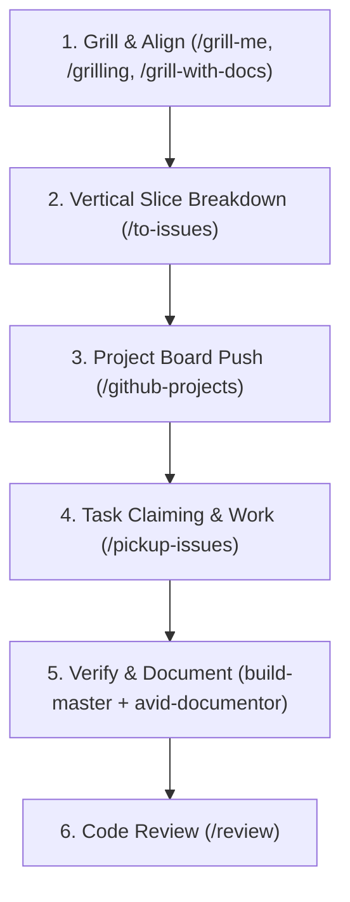
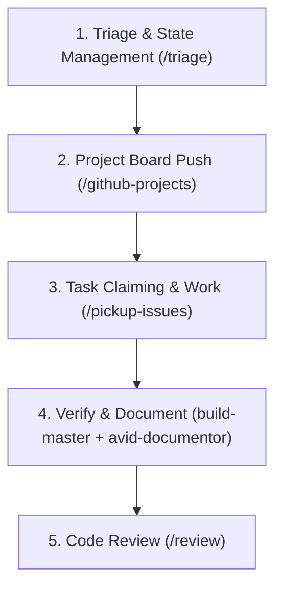

# Project Rules & Customizations

Whenever executing tasks in this workspace, you must adhere to the issue tracking, triage, and project management workflow outlined below.

## 🔄 Core Workflow Orchestration

Depending on the entry point, the workflow follows one of two distinct pathways:

### Pathway 1: Feature / Enhancement (Starts with `/grill-me`, `/grilling`, or `/grill-with-docs`)
Use this flow for building new features, major enhancements, or when planning a refactoring vertical slice.


### Pathway 2: Bug / Issue Triage (Starts with `/triage`)
Use this flow for incoming issues, bugs, or tickets that need reproduction, validation, and direct picking.


---

### 1. 💬 Grilling & Alignment (such as `/grill`,`/grill-me`,etc)
- **Purpose:** Relentlessly interviews the user about a plan or design to ensure a shared understanding before code is written.
- **Rules:**
  - Solicits feedback on one question at a time to prevent overload.
  - Resolves dependencies between decisions.
  - Explores the codebase first if questions can be answered programmatically.

### 2. 🗂️ Triage (`/triage`)
- **Purpose:** Moves issues through a state machine of triage roles (such as `needs-triage`, `needs-info`, `ready-for-agent`, `ready-for-human`, `wontfix`).
- **Rules:**
  - Evaluates issues and categorizes them (e.g., as `bug` or `enhancement`).
  - Prepares durable agent briefs for `ready-for-agent` status.
  - Conducts reproduction steps for bugs to confirm code paths.

### 3. 🎯 Vertical Slice Breakdown (`/to-issues`)
- **Purpose:** Breaks a plan, spec, or PRD into independently-grabbable, thin vertical slices (tracer bullets) that cut end-to-end through all layers (schema, API, UI, tests).
- **Rules:**
  - Proposes a list of slices with dependency relationships ("Blocked by") and covered stories.
  - Quizzes the user on granularity and relationships.
  - Formats output issues matching a standard template with acceptance criteria.

### 4. 📊 Project Board Integration (`/github-projects`)
- **Purpose:** Manages cards on GitHub Projects (Beta) boards using the GitHub CLI via helper scripts.
- **Rules:**
  - **Add to Board:** Pushes a created issue to a project:
    ```bash
    python3 /Users/rasheed/.gemini/config/skills/github-projects/scripts/github_projects_helper.py add <project_number> <issue_number>
    ```
  - **Move Columns:** Progresses issues (e.g., to "In Progress" or "Done"):
    ```bash
    python3 /Users/rasheed/.gemini/config/skills/github-projects/scripts/github_projects_helper.py move <project_number> <issue_number> <column_name>
    ```

### 5. 🚀 Task Claiming & Work (`/pickup-issues` + TDD)
- **Purpose:** Finds open project issues labeled `ready-for-agent`, claims them on GitHub, assigns them to `@me`, moves the status card to `In Progress`, and works on them autonomously using isolated git worktrees.
- **Rules:**
  - Finds unblocked issues using helper scripts.
  - Claims the issue, assigns it to `@me`, removes `ready-for-agent`, and adds `in-progress`.
  - Runs tasks concurrently in isolated git worktrees (`git worktree add -b issue-<number>`).
  - **Test-Driven Development (TDD):** In the worktree, strictly follow the vertical slice TDD loop:
    1. Write ONE test describing behavior (not implementation detail) using only the public interface.
    2. Watch the test FAIL (RED).
    3. Write the minimal implementation code to make it PASS (GREEN).
    4. Refactor clean code only while in a GREEN state.
    5. Repeat for each behavior slice.

### 6. ⚙️ Verify & Document (`build-master` + `avid-documentor`)
- **Purpose:** Gateway verification validating type safety, test suites, builds, and architectural alignment.
- **Rules:**
  - **Automated Verification:** Runs lint, typechecks (`tsc --noEmit`), backend compilation, and unit/integration tests (`npm run test`, `pytest`).
  - **iOS/PWA Compliance:** Validates PWA manifests, touch target sizes ($\ge 44 \times 44\text{pt}$), and meta tags.
  - **Architectural Documentation:** Executes the `avid-documentor` skill to automatically capture design decisions and update `docs/GEMINI.md`, ADRs, and `TODO.md` to reflect component changes.

### 7. 🔍 Code Review (`/review`)
- **Purpose:** Performs a two-axis review of the branch diff compared to the base branch (`main` or merge-base) before PR creation.
- **Rules:**
  - **Standards Axis:** Validates code complies with documented standards (e.g. `CODING_STANDARDS.md`).
  - **Spec Axis:** Validates that all requested behaviors in the original issue/PRD are completely and correctly implemented without scope creep.
  - Identifies hard violations versus judgment calls in parallel sub-agents to avoid context pollution.
