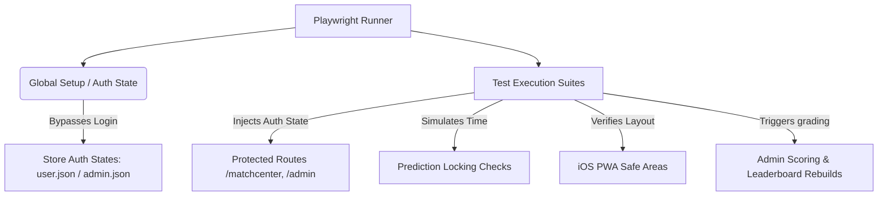

aso# Playwright Test Plan for Gully Predict

This plan outlines the architecture, configuration, and implementation strategy for adding End-to-End (E2E) and integration tests to **Gully Predict** using **Playwright**.

---

## 📋 Architectural Overview & Test Strategy

Playwright will run tests against the frontend (Vite/React) and mock or interact with the backend (FastAPI) running in dev mode. Since Gully Predict has a robust Dev Login bypass and complex business rules (like locking predictions 30 minutes before toss, and joined-date scoring rules for private leagues), our strategy relies on **seeding authentication states** and **simulating time-based locks**.



---

## 🛠️ 1. Setup & Configuration

### Package Dependencies
We will install Playwright as a dev dependency inside the `frontend` folder:
```bash
npm install -D @playwright/test
npx playwright install
```

### Config File: `frontend/playwright.config.ts`
We will configure Playwright to manage different viewports (Desktop vs. iOS PWA), start/use the local servers, and handle authentication storage states.

```typescript
import { defineConfig, devices } from '@playwright/test';
import dotenv from 'dotenv';
import path from 'path';

// Load environment variables from the root .env
dotenv.config({ path: path.resolve(__dirname, '../.env') });

const PORT = process.env.PORT || 5000;
const BASE_URL = `http://localhost:${PORT}`;

export default defineConfig({
  testDir: './playwright/tests',
  fullyParallel: true,
  forbidOnly: !!process.env.CI,
  retries: process.env.CI ? 2 : 0,
  workers: process.env.CI ? 1 : undefined,
  reporter: 'html',
  
  use: {
    baseURL: BASE_URL,
    trace: 'on-first-retry',
    screenshot: 'only-on-failure',
    video: 'retain-on-failure',
  },

  projects: [
    // Setup project for shared auth states
    {
      name: 'setup',
      testMatch: /.*\.setup\.ts/,
    },

    // Desktop Browsers
    {
      name: 'chromium-desktop',
      use: { 
        ...devices['Desktop Chrome'],
        // Exclude setup dependency for public routes if needed, otherwise inherit
      },
    },

    // iOS PWA Mobile Viewport (Crucial for Mobile-First & Safe Areas verification)
    {
      name: 'webkit-mobile',
      use: {
        ...devices['iPhone 14 Pro'],
        // Set safe-area-insets to test iOS notch/home-indicator paddings
        viewport: { width: 393, height: 852 },
        userAgent: 'Mozilla/5.0 (iPhone; CPU iPhone OS 16_0 like Mac OS X) AppleWebKit/605.1.15 (KHTML, like Gecko) Version/16.0 Mobile/15E148 Safari/604.1',
        deviceScaleFactor: 3,
        hasTouch: true,
      },
    },
  ],

  // Automatically spin up frontend dev server if not already running
  webServer: {
    command: 'npm run dev -- --port 5000',
    url: 'http://localhost:5000',
    reuseExistingServer: !process.env.CI,
    timeout: 120000,
  },
});
```

---

## 🔑 2. Authentication State Management (`storageState`)

Instead of forcing every single test to load the login page and click buttons, we will execute a global setup that authenticates once per user role and saves the credentials.

Since the React app uses Zustand + local storage persistence (`ipl-fantasy-auth`), we can programmatically login or inject state into `localStorage` within our test helper.

### Shared Auth Setup (`playwright/tests/auth.setup.ts`)
```typescript
import { test as setup, expect } from '@playwright/test';

setup('Authenticate as Admin', async ({ page }) => {
  // Using the Dev Login Bypass built in Login.tsx
  await page.goto('/login');
  
  // Verify bypass UI is visible (requires VITE_DEV_LOGIN=true)
  const adminBypassBtn = page.getByRole('button', { name: 'admin', exact: true });
  await expect(adminBypassBtn).toBeVisible();
  
  await adminBypassBtn.click();
  
  // Wait for landing page navigation
  await page.waitForURL('**/matchcenter');
  
  // Save storage state (cookies + localStorage)
  await page.context().storageState({ path: 'playwright/.auth/admin.json' });
});

setup('Authenticate as Standard User', async ({ page }) => {
  await page.goto('/login');
  const userBypassBtn = page.getByRole('button', { name: 'user', exact: true });
  await userBypassBtn.click();
  await page.waitForURL('**/matchcenter');
  
  await page.context().storageState({ path: 'playwright/.auth/user.json' });
});
```

---

## 🧪 3. Core Test Suites & Scenarios

### Suite 1: Authentication & Public Routes (`auth.spec.ts`)
Ensures login restrictions, error messaging, and unauthorized redirects work properly.
- **Test cases**:
  - Unauthenticated user navigating to `/matchcenter` gets redirected to `/login` with location state preserved.
  - Verifying the guest list access error: Navigating to `/login?error=not_invited` renders the `ACCESS DENIED` banner.
  - Verifying Google OAuth cancellation toasts error properly.

### Suite 2: Match Predictions & Toss Locks (`match-predictions.spec.ts`)
Tests prediction forms, input validations, powerups, and strict lock timings.
- **Test cases**:
  - **Dynamic Input Fields**: Submitting a prediction card. Validating input ranges (e.g. powerplay score within [0, 150]).
  - **Powerups (2x Booster)**: Toggling `use_powerup` checkboxes and confirming points calculations scale.
  - **Time Lock Simulator**:
    - Mock time 31 minutes before toss: Check fields are enabled, and predictions can be saved successfully.
    - Mock time 29 minutes before toss: Check fields are disabled, "Lock" status indicator is active, and submissions return errors.
    - *Playwright Clock API Implementation*:
      ```typescript
      test('Predict fields lock 30 min before start time', async ({ page }) => {
        // Set mock system clock to 29 mins before match start
        const startTimestamp = new Date('2026-06-20T19:30:00Z').getTime();
        const mockTime = startTimestamp - (29 * 60 * 1000); 
        await page.clock.setFixedTime(mockTime);
        
        await page.goto('/match/match-id-123');
        // Assert prediction form controls (buttons, inputs) are disabled
        await expect(page.locator('input[name="ppscore_team1"]')).toBeDisabled();
      });
      ```
  - **Community Reveal Segmentation**:
    - Prior to lock: Navigating to `GET /matches/{id}/predictions/all` returns `403 Forbidden` / locked notice.
    - Post lock: Other users' predictions are revealed and sorted by support groups (`match_winner` supports).

### Suite 3: Leaderboard & Scoping (`leaderboard.spec.ts`)
Verifies tournament and league filter scoping via URLs.
- **Test cases**:
  - Changing selectors updates query parameter `?tournament=T123`.
  - Verifying powerup indicators show both global remaining balance and playoffs-specific balances.
  - **Private League Joined-Date Rules**:
    - User A joined League L1 *after* Match 1 started. User B joined *before*.
    - Assert User A leaderboard entry excludes Match 1 scores.
    - Assert User B leaderboard entry includes Match 1 scores.

### Suite 4: Admin Dashboard & Grading (`admin.spec.ts`)
Uses `storageState: 'playwright/.auth/admin.json'` to test scoring and management tasks.
- **Test cases**:
  - **Campaign Creator**: Creating a new custom General/Match Campaign with unique question keys.
  - **Match Results Seeding**: Entering the winning team, player of the match, and scores into the admin form.
  - **Scoring Engine Verification**: Triggering grading and asserting that the `LeaderboardCache` updates and is invalidating correct memory keys.

### Suite 5: iOS/PWA UX Verification (`ios-pwa.spec.ts`)
Enforces iOS safe area checks and touch target regulations.
- **Test cases**:
  - **Safe Area Insets**: Verifying that elements like headers and bottom navigation bars respect `env(safe-area-inset-top)` and `env(safe-area-inset-bottom)` styles (e.g. checking computed padding values are non-zero when run in WebKit mobile project).
  - **Touch Targets**: Programmatically check that all interactive elements (buttons, inputs, links) are at least `44x44px`.
    ```typescript
    test('All buttons meet minimum touch target guidelines (44x44px)', async ({ page }) => {
      await page.goto('/matchcenter');
      const buttons = page.locator('button, a, input[type="submit"]');
      const count = await buttons.count();
      for (let i = 0; i < count; i++) {
        const box = await buttons.nth(i).boundingBox();
        if (box) {
          expect(box.width).toBeGreaterThanOrEqual(44);
          expect(box.height).toBeGreaterThanOrEqual(44);
        }
      }
    });
    ```
  - **PWA Installation Banner**: Renders appropriately and doesn't conflict with main viewport actions.

---

## 🏃 4. Proposed Execution Scripts

We will add the following npm commands in the `frontend/package.json` file:
- `npm run test:e2e` - Run Playwright tests in headless mode.
- `npm run test:e2e:ui` - Launch Playwright's interactive UI runner.
- `npm run test:e2e:debug` - Launch tests in inspector mode for debugging.

---

## 📝 5. Next Steps

1. **Install Dependencies**: Execute `npm install` for Playwright packages.
2. **Scaffold Folder Structure**: Create the `frontend/playwright/tests` and `frontend/playwright/utils` directories.
3. **Configure Playwright**: Put `playwright.config.ts` in the `frontend` folder.
4. **Implement Auth Helper**: Script the dev-bypass login sequence.
5. **Write First E2E Spec**: Implement `auth.spec.ts` and `match-predictions.spec.ts` as proof of concept.
